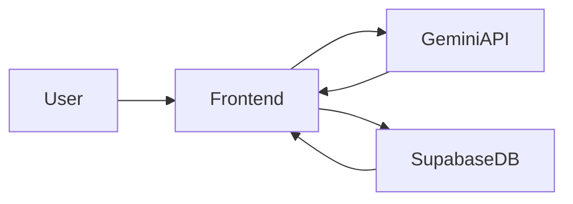

#  LinguistPro

A simple and modern **word & phrase translator** that allows users to search English words or phrases and translate them into their selected language using the **Gemini API**.
The app is designed to help users quickly understand new vocabulary and reinforce learning with features like **favorites** and **quizzes**.


## ✨ Features

- 🔎 **Search**
  - Search for English words or phrases
  - Get translations, synonyms, example sentences instantly using Gemini API
  - Text-to-speech
  - Clean and simple UI

- ⭐ **Favorites**
  - Save words or phrases you want to remember or look back
  - Quickly access your saved translations

- 🔎 **History**
  - Autosave search history up to 30
  - Quickly access your search history

- 🧠 **Quiz**
  - Practice vocabulary
  - Reinforce learning through simple quizzes
  - Options to choose difficulty level


## 🏗 System Architecture
The application follows a simple client-driven architecture where the frontend communicates with the translation API and the database service.



## 🛠 Tech Stack

- **Frontend:** React (Typescript)
- **API:** Google Gemini API


## 🗄 Database Schema

The application uses **Supabase (PostgreSQL)** as the backend database.  
The schema is intentionally simple so it can be easily migrated to other database services such as Firebase, MongoDB, or MySQL.

### `histories`

Stores the translation search history for each user.

| Column | Type | Description |
|------|------|-------------|
| id | uuid | Unique identifier for the history record |
| user_id | uuid | Reference to authenticated user |
| word | text | English word or phrase searched |
| target_lang | text | Target language selected |
| entry | jsonb | Translation result returned from the API |
| created_at | timestamp | Time the search was performed |

### `favorites`

Stores words or phrases saved by the user for later review.

| Column | Type | Description |
|------|------|-------------|
| id | uuid | Unique identifier for the favorite record |
| user_id | uuid | Reference to authenticated user |
| word | text | Saved word or phrase |
| entry | jsonb | Stored translation result |
| created_at | timestamp | Time the word was saved |

### Relationships

```
users
 │
 ├── histories
 │      └── stores searches
 │
 └── favorites
        └── stores saved vocabulary
```

Both tables reference the authenticated user (`auth.users.id`).  
Records are automatically removed if the user account is deleted (`CASCADE`).

### SQL Implementation

```sql
create table public.histories (
  id uuid not null default extensions.uuid_generate_v4 (),
  user_id uuid null,
  word text not null,
  target_lang text not null,
  entry jsonb not null,
  created_at timestamp with time zone not null default timezone ('utc'::text, now()),
  constraint histories_pkey primary key (id),
  constraint histories_user_id_fkey foreign key (user_id)
    references auth.users (id) on delete cascade
);

create table public.favorites (
  id uuid not null default gen_random_uuid (),
  user_id uuid not null,
  word text not null,
  entry jsonb not null,
  created_at timestamp with time zone not null default now(),
  constraint favorites_pkey primary key (id),
  constraint favorites_user_id_fkey foreign key (user_id)
    references auth.users (id) on delete cascade
);
```


## ⚙️ Installation

Clone the repository:

```bash
git clone https://github.com/TripleK07/LinguistPro.git
cd LinguistPro
```

Install dependencies:

```bash
npm install
```

Run the project:

```bash
npm start
```


## 🔑 Environment Variables

Create a `.env` file in the root directory and add your Gemini API key:

```
GEMINI_API_KEY=your_api_key_here
SUPABASE_URL=your_supabase_url_here
SUPABASE_ANON_KEY=your_supabase_anon_key_here
```


## 🚀 Future Improvements

- 🌐 Support more languages
- 🔊 Pronunciation / text-to-speech
- 📚 Vocabulary learning modes
- ☁️ Cloud sync for favorites
- 📊 Quiz progress tracking

  **LinguistPro** is a hobby project designed to make language learning faster and more interactive by combining translation with vocabulary practice. 
> It is a **hobby project** and completely **free to fork or clone**, so anyone can use it, experiment, or contribute.
